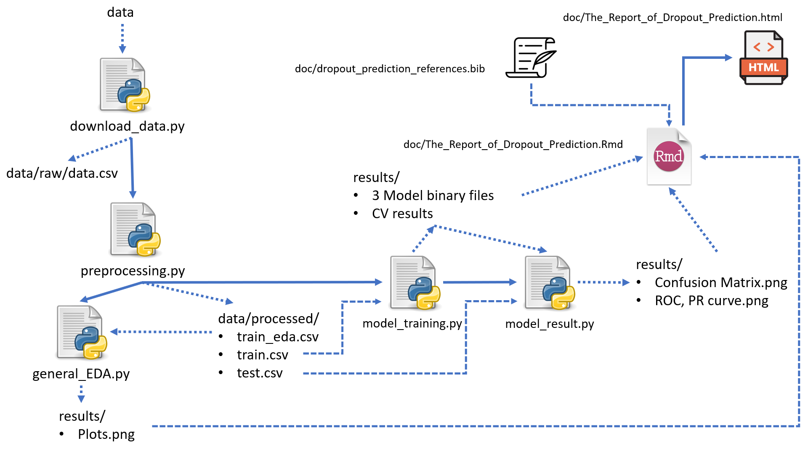

# Student Dropout Predictor

* Author: Ranjit Sundaramurthi
* contributors: Andy Wang, Caesar Wong, Ziyi Chen

# Introduction

## Objective

Academic performance/graduation in a population is an important factor in their overall employability which contributes towards economic development. This Data Science project predicts Student Dropout given the factors on demography, socioeconomics, macroeconomics, and relevant academic data provided by the Student on enrollment. This prediction is important to understand the student's academic capacity. This important knowledge can be used to identify key areas of development such as the development of socially disadvantaged communities, improvement of academic programs, development of educational funding programs, etc.  This project will try to investigate the following research questions:

> **Given a student with his/her demography, socioeconomics, macroeconomics, and relevant academic data, how accurately can we predict whether he/she will drop out of school?**

> **What are the main factors contributing to the student dropout rate?**

## Dataset

The dataset used in the project contains data collected at the time of student enrollment and a snapshot of their performance at the end of the 2nd semester at their respective Universities. This includes discrete and continuous data that capture the various facets of the student. These include macroeconomic factors of inflation, GDP, and the unemployment rate. It covers the personal/family details of the student such as gender, previous grade, educational special needs, financial status, parents' education, and parents' occupation. It captures aspects of the educational system such as coursework enrolled, day/evening classes, scholarships offered, etc. The dataset is created by Valentim Realinho, Mónica Vieira Martins, Jorge Machado, and Luís Baptista from the Polytechnic Institue of Portalegre. It was sourced from the UCI Machine Learning Repository and can be downloaded from [here](https://archive-beta.ics.uci.edu/dataset/697/predict+students+dropout+and+academic+success). Each row represents the details pertaining to an individual student and there are no duplicates. 

The original dataset exhibits three classifications (class) of students - Graduate, Enrolled, and Dropout. For the binary classification question pursued in this project, the class Enrolled is omitted from the dataset. The preliminary EDA shows there are 2209 examples of Graduate students and 1421 examples of Dropouts. Thus the dataset imbalance is not a major concern and can be addressed through balancing techniques learned in the MDS program.  

## Analysis Roadmap

We plan to partition the dataset into training and test sets (80%: 20%). A detailed EDA will be performed to understand the distribution of the 36 features and their correlation. The insights from EDA will be used to either eliminate features to reduce redundancy or to create new features that may better explain the variance between the target classes. Box plots will be used on the continuous features such as Inflation rate, GDP, and Unemployment rate. A t-test may be performed to draw further inferences on whether these metrics come from separate distributions which could increase their feature importance. Pairwise scatter plots between the selected features are planned to develop an overall understanding of the feature correlation.    

We aim to perform preliminary modeling using the Naive Bayes and Logistic Regression classification algorithms to identify the best-performing model. The Naive Bayes algorithm is shortlisted for its ability to scale well and handle sparse data. With multiple categorical features, we anticipate sparsity in our model. The logistic Regression algorithm is chosen for its similar advantages to the Naive Bayes algorithm along with the attractive advantage of providing interpretability for feature importance selection. The performance metrics for our problem statement are `Recall`, `f1 score`, and `AUC` respectively, in order of importance. Type 2 errors where actual dropouts are not identified reduce the usefulness of our project. Thus `Recall` is an essential performance metric. The Type 1 errors indicated by the precision of the model are of relatively lesser significance as actual graduates incorrectly classified as dropouts will provide a conservative model which is relatively acceptable.

## Results and Conclusions Roadmap

The hyperparameters of the aforementioned models will be optimized using cross-validation to determine the best estimator. The performance of these models will be tabulated in the report for comparison. The reasons for the best estimator selection will be documented along will modeling assumptions and identified deficiencies. The train data will be refit on the best estimator and the final predictions will be made on the test data. The confusion matrix will be documented and included in the final report along with comments on any misclassifications and their effect on model performance.

The preliminary EDA performed as part of the Milestone 1 objectives can be found in the [dropout_pred_EDA.pdf](https://github.com/UBC-MDS/dropout-predictions/blob/main/src/dropout_pred_EDA.pdf).

## Data Analysis Pipeline

In this project, we will adopt the following data analysis pipeline. First of all, we will dowload and preprocess the raw data. After splitting and storing the required data files, we will use the `train_eda.csv` as the input of `general_EDA.py`, `train.csv` for `model_training.py`, and `testing.py` for `model_result.py`.

## Usage

To replicate the analysis, clone [this](https://github.com/UBC-MDS/dropout-predictions.git) GitHub repository, install the
conda environment listed in [here](https://github.com/UBC-MDS/dropout-predictions/blob/main/env/dropout_pred_env.yml) 
> `conda env create -f env/dropout_pred_env.yml`

activate the environment 
> `conda activate dropout_pred_env`

and run the following commands `bash data_analysis_pipeline.sh` under `src` folder:

    

    <<comment
    This shell script will include all the script running required to reproduce the dropout prediction analysis.
    Please run this script within the src/ folder
    comment

    # download data
    python download_data.py --url="https://raw.githubusercontent.com/caesarw0/ml-dataset/main/students_dropout_prediction/data.csv" --extract_to="../data/raw/data.csv"

    # preprocess data 
    python preprocessing.py --input_path="../data/raw/data.csv" --sep=',' --test_size=0.2 --random_state=522 --output_path="../data/processed"

    # generate EDA plot
    python general_EDA.py --input_path="../data/processed/train_eda.csv" --output_path="../results/"

    # model training
    python model_training.py --train="../data/processed/train.csv" --scoring_metrics="recall" --out_dir="../results/"

    # model testing
    python model_result.py --test="../data/processed/test.csv" --out_dir="../results/"

> conda deactivate
> Rscript -e 'rmarkdown::render("../doc/The Report of Dropout Prediction.Rmd")'

## License

The Student Dropout Predictor materials here are licensed under the Creative Commons Attribution 4.0 International (CC BY 4.0) license. This allows for the sharing and adaptation of the datasets for our purpose of academic study and understanding, with the appropriate credit given.

## References

- Realinho,Valentim, Vieira Martins,Mónica, Machado,Jorge & Baptista,Luís. (2021). Predict students' dropout and academic success. UCI Machine Learning Repository. https://archive-beta.ics.uci.edu/dataset/697/predict+students+dropout+and+academic+success

