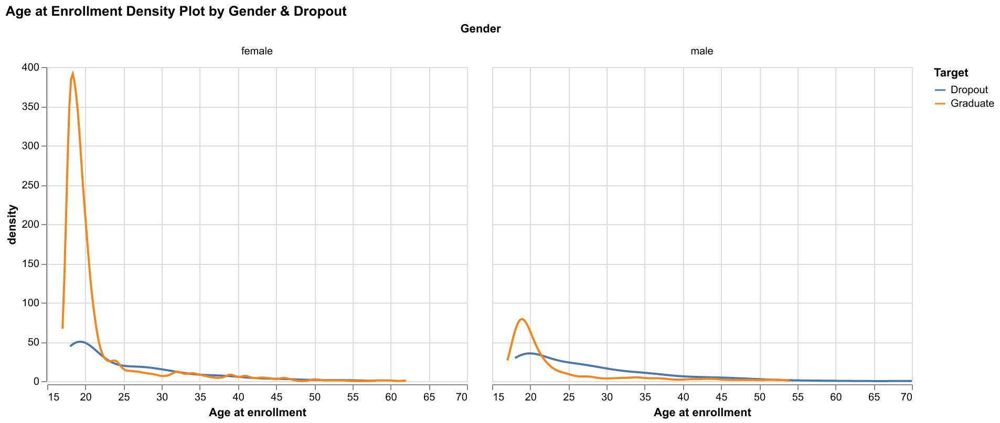

# Library used
```{r setup, include=FALSE}
knitr::opts_chunk$set(echo = TRUE)
library(tidyverse)
library(kableExtra)
library(knitr)
```

```{r load model results, message=FALSE, warning=FALSE, echo=FALSE}
result_csv <- read_csv("../results/cv_result.csv")
colnames(result_csv) <- c("Item", rep("LogisticRegression", 2), 
                          rep("NaiveBayes", 2),
                          rep("RandomForest", 2)
                          )
knitr::kable(result_csv, caption = "Table 1. Horse population in Canada")|>
    kableExtra::kable_styling(full_width = FALSE)
```

# Summary


# Introduction
Academic performance/graduation in a population is an important factor in their overall employability which contributes towards economic development.Student Dropout given the factors on demography, socioeconomics, macroeconomics, and relevant academic data provided by the Student on enrollment. This prediction is important to understand the student's academic capacity. This important knowledge can be used to identify key areas of development such as the development of socially disadvantaged communities, improvement of academic programs, development of educational funding programs, etc. This project will try to investigate the following research questions:
1. Given a student with his/her demography, socioeconomics, macroeconomics, and relevant academic data, how accurately can we predict whether he/she will drop out of school?
2. What are the main factors contributing to the student dropout rate?

# Methods
## Data
The dataset used in the project contains data collected at the time of student enrollment and a snapshot of their performance at the end of the 2nd semester at their respective Universities. This includes discrete and continuous data that capture the various facets of the student. These include macroeconomic factors of inflation, GDP, and the unemployment rate. It covers the personal/family details of the student such as gender, previous grade, educational special needs, financial status, parents' education, and parents' occupation. It captures aspects of the educational system such as coursework enrolled, day/evening classes, scholarships offered, etc. The dataset is created by Valentim Realinho, Mónica Vieira Martins, Jorge Machado, and Luís Baptista from the Polytechnic Institue of Portalegre. It was sourced from the UCI Machine Learning Repository and can be downloaded from [here](https://archive-beta.ics.uci.edu/dataset/697/predict+students+dropout+and+academic+success). Each row represents the details pertaining to an individual student and there are no duplicates.

The original dataset exhibits three classifications (class) of students - Graduate, Enrolled, and Dropout. For the binary classification question pursued in this project, the class Enrolled is omitted from the dataset. The preliminary EDA shows there are 2209 examples of Graduate students and 1421 examples of Dropouts. Thus the dataset imbalance is not a major concern and can be addressed through balancing techniques learned in the MDS program.


## Analysis
### EDA
The EDA report will include data splitting, correlation analysis, and several sections investigating different types of features.We used correlation matrix, (feature importance) bar plot and density plot to explore relationships among different features.

### Modeling


# Results & Discussion

```{r target_count_bar_plot, echo=FALSE, fig.cap="Figure 1. Visualization of targets of three categories.", out.width = '100%'}
knitr::include_graphics("../results/target_count_bar_plot.png")
```

From the above plot, we can see this problem was a three-category classification task, and there exists a strong imbalance between those three classes. The class Graduate has the majority count which is around 50% of the records and Dropout has 32% of the total records. The Enrolled only has 18% of the total records. Thus, during our training, we need to find a way to fix this imbalance issue, possible solution would be setting the `class_weight` in our model. We decide to drop one category which is enrolled student and only focus on graduate & dropout students to train our models.After dropping the Enrolled students, we have around 60% graduated students and 40% dropout students.


```{r correlation_heatmap_plot, echo=FALSE, fig.cap="Figure 2. Heatmap of correlation across all features.", out.width = '100%'}
knitr::include_graphics("../results/correlation_heatmap_plot.png")
```

From the correlation heatmap, we can observe that some features are strongly correlated (the dark red color), for example, Nationality & International, Age at enrollment & Application mode. There are some features with negative correlation, for example, Age at enrollment & Daytime Evening Attendance. In the following sections, we would like to further investigate those positively correlated features, and features in different potential categories (Demographic, Macroeconomic, Academic data at enrollment, etc.).


```{r correlation_with_target_plot, echo=FALSE, fig.cap="Figure 3. Bar plot of feature correlation for target.", out.width = '100%'}
knitr::include_graphics("../results/correlation_with_target_plot.png")
```

There are more negatively correlated features than positives one. The top 3 positively correlated features are `Age at enrollment`, `Debtor`, and `Gender`. In the below data exploration, we can further investigate their relationship.


```{r gender_density_plot, echo=FALSE, fig.cap="Figure 4. Density plot of different ages with enrollment by gender.", out.width = '100%'}

```

The density plot reveals the gender imbalance in our data set with the number of younger female students than males. More male student aged 25 to 30 tends to drop out than females. While the students after their 30s, both gender demonstrate similar patterns.

# References

Python [@van1995python]