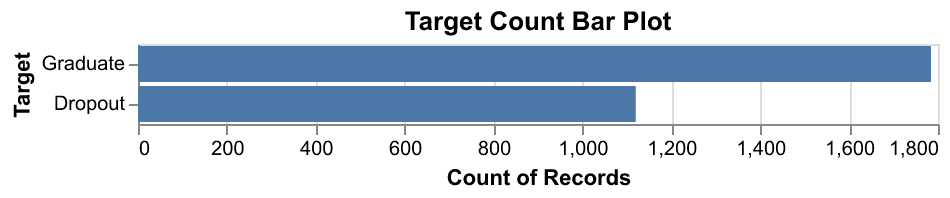
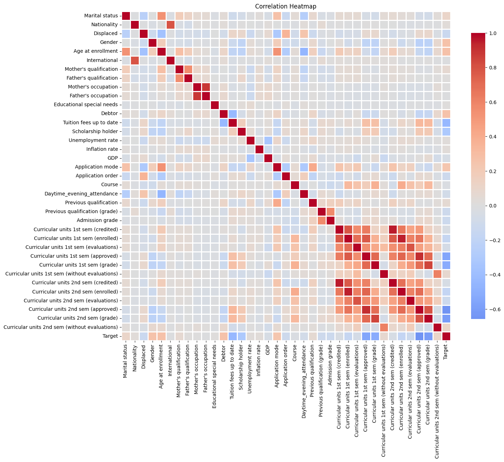
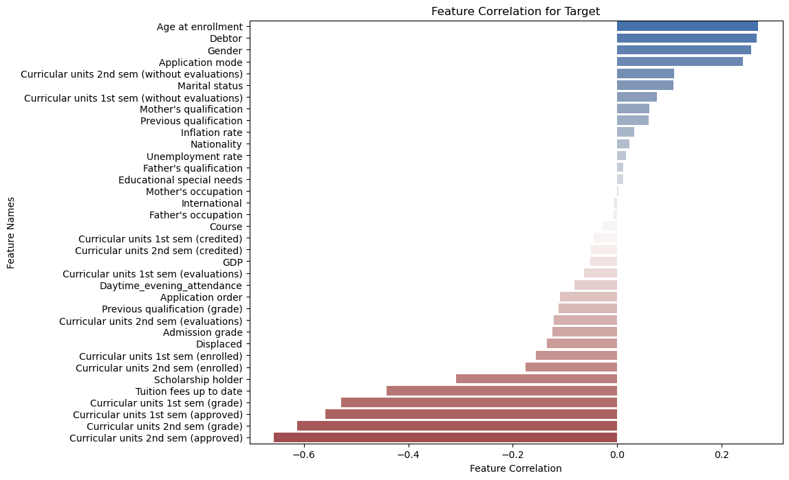
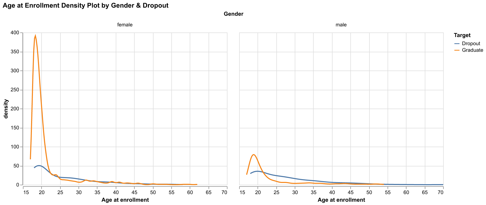
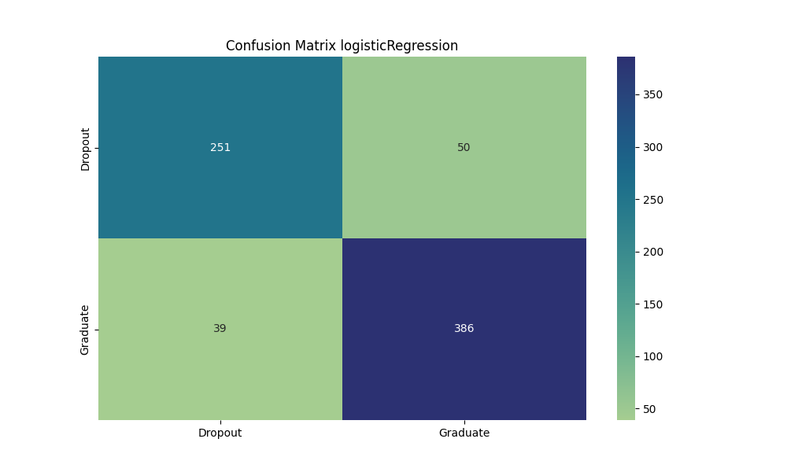
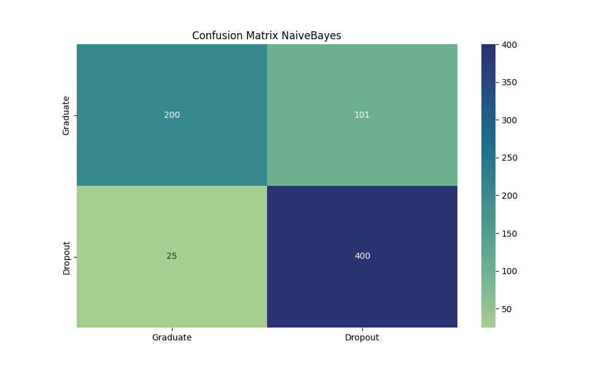
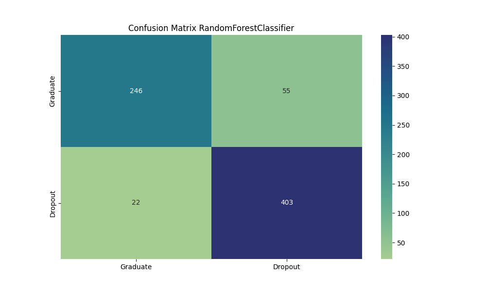
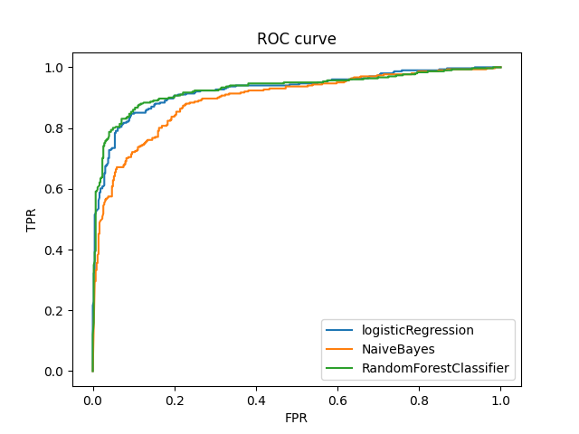

```{r setup, include=FALSE}
knitr::opts_chunk$set(echo = TRUE)
library(tidyverse)
library(kableExtra)
library(knitr)
```

```{r load model test results, echo=FALSE, message=FALSE, warning=FALSE}
test_result <- read_csv('../results/score_on_test.csv')
colnames(test_result) <- c("Item","LogisticRegression", 
                           "NaiveBayes","RandomForest"
                          )

```

```{r load model results, echo=FALSE, message=FALSE, warning=FALSE}
cv_result <- read_csv("../results/cv_result.csv")
colnames(cv_result) <- c("Item", rep("LogisticRegression", 2), 
                          rep("NaiveBayes", 2),
                          rep("RandomForest", 2)
                          )
```

# Summary

Classification task performed through machine learning algorithms deals which recognizing and grouping ideas into categories. These algorithms are used to detect patterns within existing datasets to help classify unseen and upcoming data. In this project 3 classification algorithms, `Naive Bayes`, `Logistic Regression`, `Random Forest Classifier` were used on a real-life dataset, to solve a two class classification problem. The performance of these 3 algorithms was compared through the classification metrics of `Recall`. The `Random Forest Classifier` and `Logistic Regression` algorithms performed appreciably with a high recall score of `r round(test_result[[1,4]], 2)` and `r round(test_result[[1,2]], 2)` respectively. The selection and further optimization of the best performing algorithm is planned for the future milestones of this project.

# Introduction

Academic performance/graduation in a population is an important factor in their overall employability which contributes towards economic development.Student Dropout given the factors on demography, socioeconomics, macroeconomics, and relevant academic data provided by the Student on enrollment. This prediction is important to understand the student's academic capacity. This important knowledge can be used to identify key areas of development such as the development of socially disadvantaged communities, improvement of academic programs, development of educational funding programs, etc. This project will try to investigate the following research questions:

1.  Given a student with his/her demography, socioeconomics, macroeconomics, and relevant academic data, how accurately can we predict whether he/she will drop out of school?

# Methods

## Data

The dataset used in the project contains data collected at the time of student enrollment and a snapshot of their performance at the end of the 2nd semester at their respective Universities. This includes discrete and continuous data that capture the various facets of the student. These include macroeconomic factors of inflation, GDP, and the unemployment rate. It covers the personal/family details of the student such as gender, previous grade, educational special needs, financial status, parents' education, and parents' occupation. It captures aspects of the educational system such as coursework enrolled, day/evening classes, scholarships offered, etc. The dataset is created by Valentim Realinho, Mónica Vieira Martins, Jorge Machado, and Luís Baptista from the Polytechnic Institue of Portalegre. It was sourced from the UCI Machine Learning Repository and can be downloaded from [here](https://archive-beta.ics.uci.edu/dataset/697/predict+students+dropout+and+academic+success). Each row represents the details pertaining to an individual student and there are no duplicates.

The original dataset exhibits three classifications (class) of students - Graduate, Enrolled, and Dropout. For the binary classification question pursued in this project, the class Enrolled is omitted from the dataset. The preliminary EDA shows there are 2209 examples of Graduate students and 1421 examples of Dropouts. Thus the dataset imbalance is not a major concern and can be addressed through balancing techniques learned in the MDS program.

## Modeling

The insights gained from the EDA, provided a foundation to explore multiple classification algorithms. Naive Bayes, Logistic Regression and Random Forest Classifier were implemented for their respective advantages in machine learning projects. These three algorithms provide a nice selection on the spectrum of simple (Naive Bayes) to more complex (Random Forest Classifier) algorithm. The Naive Bayes algorithm is advantageous as a simple probabilistic classification algorithm which assumes naively the independence between the features. Despite this assumption, the Naive Bayes algorithm known to be perform well on classification problems. The absence of hyperparameters and the convenient scalability with increase in training dataset, made Naive Bayes algorithm a favorable choice for this project. However, Naive Bayes algorithm falls short in terms of interpretability of features based on results. This is where the Logistic Regression algorithm shines with its ability to provide interpretable feature importances while retaining the model simplicity. The model parameters of `class weight` and the `regularization (inverse) C` were utilized to iteratively tune the performance. However Logistic Regression assumes there is inherent linearity between our features and the classification target. We are interested to implement an algorithm which overcomes this limitation and this led us to the selection of the Random Forest Classifier algorithm. Random Forest Classifier leverages ensemble learning through multiple Decision Trees, which reduces the tendency of overfitting to the training data. This is especially useful when the number of records (train examples) are limited as is the case in our project. This made Random Forest a favorable choice for our project. The parameters of `max_features`, `max_depth`, `min_samples_leaf`, and `min_samples_leaf` were optimized through `RandomSearchCV`. The Python 3 programming language [@van1995python] and the following Python packages were used to perform the analysis: Scikit-learn [@pedregosa2011scikit], Numpy [@harris2020array], Pandas [@mckinney2010data], Seaborn [@waskom2017mwaskom], Altair[@vanderplas2018altair], Matplotlib[@tosi2009matplotlib]; And the following external resources: The Origins of Logistic Regression [@cramer2002origins], Random Forests [@breiman2001random], Predict students' dropout and academic success data set [@misc_predict_students], related research article [@realinho2022predicting]

The code to perform the analysis and create the report can be found [here](https://github.com/UBC-MDS/dropout-predictions)

# Results & Discussion

## EDA

```{r target_count_bar_plot, echo=FALSE, fig.cap="Figure 1. Visualization of targets of three categories.", out.width="100%"}

```

From the above plot, we can see this problem was a three-category classification task, and there exists a strong imbalance between those three classes. The class Graduate has the majority count which is around 50% of the records and Dropout has 32% of the total records. The Enrolled only has 18% of the total records. Thus, during our training, we need to find a way to fix this imbalance issue, possible solution would be setting the `class_weight` in our model. We decide to drop one category which is enrolled student and only focus on graduate & dropout students to train our models.After dropping the Enrolled students, we have around 60% graduated students and 40% dropout students.

```{r correlation_heatmap_plot, echo=FALSE, fig.cap="Figure 2. Heatmap of correlation across all features.", out.width="100%"}

```

From the correlation heatmap, we can observe that some features are strongly correlated (the dark red color), for example, Nationality & International, Age at enrollment & Application mode. There are some features with negative correlation, for example, Age at enrollment & Daytime Evening Attendance. In the following sections, we would like to further investigate those positively correlated features, and features in different potential categories (Demographic, Macroeconomic, Academic data at enrollment, etc.).

```{r correlation_with_target_plot, echo=FALSE, fig.cap="Figure 3. Bar plot of feature correlation for target.", out.width="100%"}

```

The top 3 positively correlated features are `Age at enrollment`, `Debtor`, and `Gender`. In the below data exploration, we can further investigate their relationship.

```{r gender_density_plot, echo=FALSE, fig.cap="Figure 4. Density plot of different ages with enrollment by gender.", out.width="100%"}

```

The density plot reveals the gender imbalance in our data set with the number of younger female students than males. More male student aged 25 to 30 tends to drop out than females. While the students after their 30s, both gender demonstrate similar patterns.

####Notes: Due to limited length of the report, the general visualization for the numerical & categorical features will be shown in the archive EDA notebook

## Modeling

The objective of this project is to investigate how accurately we can predict that a student will drop out of school. Furthermore what underlying factors are the predominant influencing this outcome? Accurate classification of a true drop out in the available data is our chosen metric of interest. This is defined as `Recall` and it represents the proportion of the true drop-outs in the dataset, accurately predicted by the model. Each of the three models Naive Bayes, Logistic Regression and Random Forest Classifier were fitted on training data. The hyperparameter tuning was performed on using `Random Search CV` for Logistic Regression and Random Forest Classifier. The optimized models were then used to predict the classification on the test data. The performance of the models was compared through the Confusion Matrix, Precision-Recall curve, and Receive-Operating Characteristics plots. The metrics were tabulated for numerical interpretation.

Our train-test split yielded 726 examples in the testing dataset. There are 425 actual class `Dropout` and the rest are `Graduate`. The classification as a `Dropout` is considered a True Positive in the context of this project. The `Logistic Regression` model identified the highest True positives among the three models (386) and achieved a superior recall metric of `r round(test_result[[1,2]], 2)`. `Naive Bayes` model came close behind with 400 true positives at a recall metric of `r round(test_result[[1,3]], 2)`. The `Random Forest` model achieved an appreciable recall metric of `r round(test_result[[1,4]], 2)` with 403 true positive. Overall, the `Logistic Regression` model result in the highest recall score (`r round(test_result[[1,2]], 2)`) and since we focus on the recall score (those who drop out of school), therefore, we conclude that the `Logistic Regression` model perform the best in terms of recall.

The `Random Forest Classifier` and `Logistic Regression` performed appreciably on the `f1` score which is a balanced measure of model `precision` and `recall`. However Naive Bayes suffered a relative low `f1` score due to a low `precision`. This is due to more False Positives predicted by `Naive Bayes` than the other models. The corresponding confusion matrices derived from the analysis are shown below for reference.

```{r print model test results, echo=FALSE, message=FALSE, warning=FALSE}
knitr::kable(test_result, caption = "Table 1. Testing Score Results")|>
    kableExtra::kable_styling(full_width = FALSE)

```

```{r Confusion_Matrix_logisticRegression, echo=FALSE, fig.cap="Figure 5. Confusion matrix for Logistic Regression.", out.width="100%"}

```

```{r Confusion_Matrix_NaiveBayes, echo=FALSE, fig.cap="Figure 6. Confusion matrix image for Naive Bayes.", out.width="100%"}

```

```{r Confusion_Matrix_RandomForestClassifier, echo=FALSE, fig.cap="Figure 7. Confusion matrix image for RandomForest.", out.width="100%"}

```

The performance of the three models can be visually inferred through the `Precision-Recall` plot and the `ROC-AUC` plot. Both the plots agree with our inferences from the confusion matrices. The `Logistic Regression` model provides good combination of Precision and Recall that can be leveraged to further improve the model performance. The default threshold of 0.5 is used in this model. The area under the `ROC-AUC` plot is a measure of the model performance. The `Naive Bayes` model is clearly outperformed by the other two models. The metrics are are tabulated below for reference.

```{r PR_curve, echo=FALSE, fig.cap="Figure 8. Precision and Recall Curve.", out.width="100%"}
knitr::include_graphics("../results/PR_curve.png")
```

```{r ROC_curve, echo=FALSE, fig.cap="Figure 9. ROC (receiver operating characteristic) Curve.", out.width="100%"}

```

```{r print model results, echo=FALSE, message=FALSE, warning=FALSE}
cv_result <- read_csv("../results/cv_result.csv")
colnames(cv_result) <- c("Item", rep("LogisticRegression", 2), 
                          rep("NaiveBayes", 2),
                          rep("RandomForest", 2)
                          )
knitr::kable(cv_result, caption = "Table 2. Cross Validation Results")|>
    kableExtra::kable_styling(full_width = FALSE)
```

The current analysis is performed using the features selected post EDA through human judgement based on the project context. Both the models `Logistic Regression` and `Random Forest Classifier` have a small number of False Negatives. These are students who are actually `Dropout` but were incorrectly classified as `Graduate` by the models. In the context of this project, it is our endeavor to minimize these False Negatives as much as possible. The further steps will involve investigative methodologies such as `Feature Selection` and `Feature Engineering` to reduce the False Negatives and further improve the performance.

# Limitations

Even though we performed serval machine learning processes to improve our workflow, the current project faces the following limitations:

-   Only three models have been selected for model comparison\
-   Further feature engineering is required to obtain different potential useful features\
-   Some of the features are dropped at the early stage that might be a useful features in the feature engineering stage (e.g. combination of different features)
-   Limited iterations in the randomized search, there could be some parameter values with better performance that the current search has not covered

# Future Directions

Based on the limitation listed above, we can imporve our project by the following directions:

-   Further `Feature Selection` & `Feature Engineering` is needed. Train the model using different feature sets, we can explore different combination of the features and perform different transformation, for example, polynomial transformation\
-   Use a variety of model to compare the performance, such that the comparison will be more comprehensive\
-   Increase the iteration in randomized search in order to search for more potentially beneficial parameter values\
-   Increase code modularization by using object oriented programming\
-   Adopt better code logging practice instead of using the print function

# References
